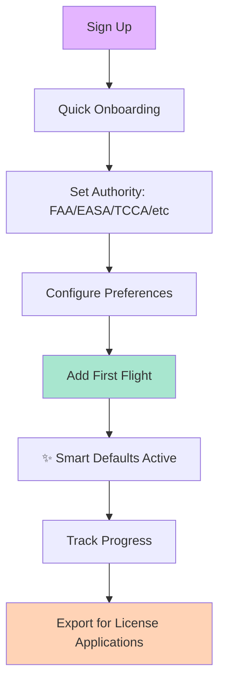
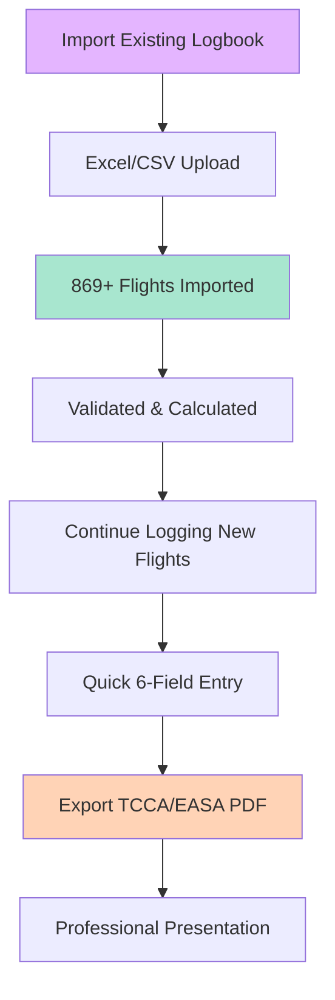

# ✈️ Digital Pilot Logbook

> *From an airline pilot with 25+ years of logbook experience and a tech-savvy engineer's perspective*

A modern, intelligent digital logbook built for pilots by pilots. Transform hours of manual logging into seconds of smart entry while maintaining full regulatory compliance.

---

## 🎯 The Pilot's Challenge

After 25 years of flying and thousands of logbook entries, here's what every pilot knows:

```
Traditional Paper Logbook          Commercial Logbook Software
        ↓                                    ↓
   ┌─────────────┐                    ┌──────────────┐
   │ Pros:       │                    │ Pros:        │
   │ • Reliable  │                    │ • Digital    │
   │ • Accepted  │                    │ • Backups    │
   │             │                    │              │
   │ Cons:       │                    │ Cons:        │
   │ • Slow      │                    │ • Expensive  │
   │ • Error-    │                    │ • Complex    │
   │   prone     │                    │ • 12-20      │
   │ • Not       │                    │   fields per │
   │   portable  │                    │   entry      │
   │ • Hard to   │                    │ • $60-80+    │
   │   analyze   │                    │   /year      │
   └─────────────┘                    └──────────────┘
         ↓                                    ↓
         └──────────────┬─────────────────────┘
                        ↓
              ⏱️ 60-90 seconds per entry
              📝 Manual calculation of 24+ time buckets
              🚫 No smart defaults
              💰 High cost or tedious manual work
```

---

## 💡 The Solution: Smart Entry, Full Detail

### The Transformation

```
BEFORE (Traditional Entry)          AFTER (Digital Pilot Logbook)
━━━━━━━━━━━━━━━━━━━━━━━━━          ━━━━━━━━━━━━━━━━━━━━━━━━━━━━
                                    
📋 12-20 Fields to Fill            📋 6-7 Smart Fields
                                    
┌──────────────────────┐           ┌──────────────────────┐
│ Date: __________     │           │ Date: [Auto: Today]  │
│ Aircraft: _______    │           │ Aircraft: [Auto:     │
│ Registration: ____   │           │   Last Used]         │
│ Departure: _______   │           │ Route: [Smart:       │
│ Arrival: _________   │           │   Last Destination]  │
│ Flight Time: _____   │           │ Flight Time: ____    │
│ SE Day PIC: ______   │           │ Role: [Quick Pick]   │
│ SE Night PIC: ____   │           │ Tags: [XC][Night]    │
│ XC Day PIC: ______   │           │                      │
│ Night: ___________   │           │ ✨ Auto-Calculated:  │
│ Dual Received: ___   │           │ • SE Day/Night PIC   │
│ As Instructor: ___   │           │ • XC allocations     │
│ Simulator: _______   │           │ • Dual/Instructor    │
│ Day T/O: _________   │           │ • 24+ time buckets   │
│ Day Ldg: _________   │           │ • Takeoffs/Landings  │
│ Night T/O: _______   │           │ • All totals         │
│ Night Ldg: _______   │           └──────────────────────┘
│ ... (8 more)         │           
└──────────────────────┘           ⏱️ 20-30 seconds
                                    ✅ Zero math errors
⏱️ 60-90 seconds                    🎯 Full compliance
❌ Error-prone calculations
📊 Manual totals
```

---

## 🚀 User Journey

### For New Pilots



### For Experienced Pilots



### Daily Flight Logging Flow

```
┌─────────────────────────────────────────────────────────────┐
│                     YOUR TYPICAL DAY                        │
└─────────────────────────────────────────────────────────────┘

Morning:
  🌅 Pre-flight planning
        ↓
  
Flight:
  ✈️  CZBB → CYCW → CYPK → CZBB
      (Cross-country training flight)
        ↓
  
Post-flight (20-30 seconds):
  
  Open App → Quick Entry Form
  ┌──────────────────────────────────────┐
  │ Date: 2026-02-04     [✓ Auto]       │
  │ Aircraft: C172       [✓ Remembered] │
  │ Registration: C-GHFH [✓ Remembered] │
  │ Route: CZBB-CYCW-CYPK-CZBB          │
  │ Time: 2.3 hours                      │
  │ Role: ◉ PIC ○ Student ○ Instructor  │
  │ Tags: [✓] XC  [✓] Day               │
  └──────────────────────────────────────┘
        ↓
  [Save Flight] ← One click
        ↓
  ✨ Automatic Calculations Applied:
     • SE Day PIC: 2.3 hrs
     • XC Day PIC: 2.3 hrs  
     • Day Takeoffs: 4
     • Day Landings: 4
     • Running Totals Updated
        ↓
  ✅ Done! Continue with your day
  
Total Time: 20 seconds
Math Errors: 0
Regulatory Compliance: 100%
```

---

## 🎨 Key Features Visualized

### 1. Intelligent Calculation Engine

```
Your Input (6-7 fields)              Calculation Engine             Output (24+ fields)
━━━━━━━━━━━━━━━━━━                  ━━━━━━━━━━━━━━━━━━             ━━━━━━━━━━━━━━━━━━

Date: 2026-02-04                          ┌─────────────┐
Aircraft: C172          ────────────────→ │   Analyze   │
Registration: C-GHFH                      │   Aircraft  │
Route: CZBB-CYCW        ────────────────→ │   Category  │
Time: 2.3 hrs                             │             │         SE Day PIC: 2.3
Role: PIC               ────────────────→ │  SE/ME/SIM  │         SE Night PIC: 0
Tags: [XC][Day]                           │             │         ME Day PIC: 0
                                          └─────────────┘         ME Night PIC: 0
                                                  │               
                        ────────────────→ ┌─────────────┐         XC Day PIC: 2.3
                                          │   Apply     │         XC Night PIC: 0
                        ────────────────→ │   Role      │         
                                          │   Rules     │         Dual Received: 0
                                          │             │         As Instructor: 0
                                          └─────────────┘         
                                                  │               Simulator: 0
                        ────────────────→ ┌─────────────┐         
                                          │  Allocate   │         Day T/O: 4
                        ────────────────→ │  Day/Night  │         Day Ldg: 4
                                          │   & XC      │         Night T/O: 0
                                          │             │         Night Ldg: 0
                                          └─────────────┘         
                                                  │               Total PIC: 2.3
                                          ┌─────────────┐         Total XC: 2.3
                                          │  Validate   │         Total Flight: 2.3
                                          │  & Verify   │         
                                          │   Totals    │         ✅ All fields
                                          └─────────────┘         ✅ Validated
                                                                  ✅ Compliant
```

### 2. Smart Defaults System

```
Learning from Your History
━━━━━━━━━━━━━━━━━━━━━━━━━━━━

Flight #1:                     Flight #2:                    Flight #50:
C172, C-GHFH                   C172, C-GHFH                 [Auto-filled]
CZBB → CYCW                    CYCW → CZBB                  C172, C-GHFH
                                                             CZBB →
        ↓                              ↓                             ↓
    
    System Learns:                 System Learns:              System Knows:
    • Your aircraft               • Return routes             • Your fleet
    • Registrations              • Common patterns           • Usual routes
    • Home base                  • Typical roles             • Your preferences
                                                            
                                    Result:
                            95% of fields auto-filled
                            You type: Route ending + Time
                            Time saved: 40-50 seconds
```

### 3. Import & Export Pipeline

```
Import Your History              Process & Validate            Continue Flying
━━━━━━━━━━━━━━━━━━              ━━━━━━━━━━━━━━━━━             ━━━━━━━━━━━━━━━

┌──────────────┐                ┌──────────────┐              ┌──────────────┐
│ Excel        │                │ Data         │              │ Add New      │
│ Spreadsheet  │───────────────→│ Validation   │              │ Flights      │
│              │                │              │              │              │
│ • 869 rows   │                │ ✓ Dates      │              │ Quick Entry  │
│ • 35 columns │                │ ✓ Aircraft   │              │ 6-7 Fields   │
│ • Your       │                │ ✓ Times      │              │              │
│   current    │                │ ✓ Totals     │              │ Auto-calc    │
│   logbook    │                │              │              │ everything   │
└──────────────┘                └──────────────┘              └──────────────┘
                                        │                              │
                                        ↓                              ↓
                                ┌──────────────┐              ┌──────────────┐
                                │ All Data     │              │ Export       │
                                │ Preserved    │              │ Professional │
                                │              │              │ PDF          │
                                │ • Lossless   │              │              │
                                │ • Verified   │              │ TCCA/EASA    │
                                │ • Searchable │              │ Compliant    │
                                │              │              │              │
                                │ 869 flights  │              │ License      │
                                │ migrated ✅  │              │ Ready ✅     │
                                └──────────────┘              └──────────────┘
```

---

## 📊 Value Proposition

### Time Savings Over One Year

```
Scenario: 100 flights per year

Traditional Logbook Software:
  100 flights × 60 seconds = 6,000 seconds = 100 minutes
  + Manual verification time  = 20 minutes
  + Error corrections         = 10 minutes
  ─────────────────────────────────────────
  Total: ~2 hours 10 minutes/year
  
Digital Pilot Logbook:
  100 flights × 25 seconds = 2,500 seconds = 42 minutes
  + Auto-verification       = 0 minutes (automatic)
  + Error corrections       = 0 minutes (prevented)
  ─────────────────────────────────────────
  Total: ~42 minutes/year
  
  TIME SAVED: 88 minutes/year per 100 flights
  
For Student Pilots (200+ flights/year):
  → Save ~3 hours/year
  
For Flight Instructors (500+ flights/year):
  → Save ~7.5 hours/year
  
For Airline Pilots (400+ flights/year):
  → Save ~6 hours/year
```

### Cost Comparison

```
Solution                  Annual Cost       Features          Entry Time
━━━━━━━━━━━━━━━━━━━━━━━  ━━━━━━━━━━━━━━━  ━━━━━━━━━━━━━━━  ━━━━━━━━━━━
Paper Logbook             $30-50           Basic             90 sec
LogTen Pro                $79.99           Advanced          60 sec
ForeFlight Logbook        $99-299          Integrated        55 sec
MyFlightbook              Free (Limited)   Basic             70 sec

Digital Pilot Logbook     $0 (Open)        Advanced+Smart    25 sec
                          $30-40 (Hosted)  Full-Featured     20 sec
━━━━━━━━━━━━━━━━━━━━━━━━━━━━━━━━━━━━━━━━━━━━━━━━━━━━━━━━━━━━━━━━━━━━━━
```

---

## 🌍 Regulatory Compliance

Supports multiple aviation authorities worldwide:

```
┌────────────────────────────────────────────────────────────────┐
│              Supported Aviation Authorities                    │
├────────────────────────────────────────────────────────────────┤
│                                                                │
│  🇺🇸 FAA    (USA)           🇪🇺 EASA   (Europe)               │
│  🇨🇦 TCCA   (Canada)        🇬🇧 UK CAA (UK)                   │
│  🇦🇺 CASA   (Australia)     🇳🇿 CAA NZ (New Zealand)          │
│  🇮🇳 DGCA   (India)         🇦🇪 GCAA   (UAE)                  │
│  🇸🇬 CAAS   (Singapore)     🇯🇵 JCAB   (Japan)                │
│  🇿🇦 SACAA  (South Africa)  🇧🇷 ANAC   (Brazil)               │
│                                                                │
│  Each authority has unique requirements:                       │
│  • Time format (decimal vs HH:MM)                             │
│  • Required fields                                             │
│  • Categorization rules                                        │
│  • Export format                                               │
│                                                                │
│  ✅ All handled automatically                                  │
└────────────────────────────────────────────────────────────────┘
```

---

## 🎓 User Stories

### Student Pilot Journey

**Sarah, 23, Private Pilot Student**

```
Month 1: Discovery Flight
  ├─ Signs up → Sets authority (FAA)
  ├─ First entry: 0.5 hrs dual, C152
  └─ System learns her instructor, aircraft

Month 3: Solo Milestone
  ├─ 25 flights logged (5 minutes total time)
  ├─ Tracks progress to solo requirements
  └─ First solo: Role changes from "Student" to "PIC"
      → System auto-adjusts all calculations

Month 6: Cross Country Phase
  ├─ 50 flights total
  ├─ XC tag automatically categorizes flights
  ├─ Progress bar: 38/40 hrs, 8/10 hrs XC
  └─ Can export for examiner review

Month 12: Checkride Ready
  ├─ 85 flights, all requirements met
  ├─ Exports professional PDF for DPE
  ├─ Passes checkride! 🎉
  └─ Continues using for career

Total time spent logging: ~35 minutes over 12 months
Total time saved vs paper: ~85 minutes
```

### Flight Instructor Workflow

**Mike, 35, CFI with 500+ students**

```
Daily Schedule:
  ├─ 6-8 flights per day
  ├─ Each flight: 20 seconds to log
  ├─ Marks as "Instructor" role
  └─ Auto-tracks CFI time for renewals

Monthly:
  ├─ Logs ~150 flights
  ├─ Time spent: ~50 minutes/month
  ├─ Paper/manual would take: ~2.5 hours
  └─ Saves 1.5 hours monthly = 18 hours/year

Annual Benefits:
  ├─ CFI renewal: Export shows all instructor time
  ├─ Insurance: Professional presentation
  ├─ ATP application: All requirements documented
  └─ Job interviews: Impressive digital portfolio
```

### Airline Pilot Perspective

**Captain James, 52, 25 years experience**

```
Starting Point:
  ├─ 12,000+ hours in paper logbooks
  ├─ Considering digitization
  └─ Uploads scanned logbook → Excel → Import

After Migration:
  ├─ All 12,000 hours digital & searchable
  ├─ Continues logging 300-400 flights/year
  ├─ 25 seconds per entry (now flies A320)
  └─ Can analyze career stats instantly

License Renewals:
  ├─ Exports professional PDF
  ├─ Includes all required time buckets
  ├─ Accepted by authority without question
  └─ Peace of mind for retirement planning

Career Analytics:
  ├─ Total hours by aircraft type
  ├─ Night/IFR/PIC breakdown
  ├─ Track currency requirements
  └─ Portfolio for future opportunities
```

---

## 🔧 Technical Architecture (Brief)

Built with modern, reliable technology:

```
Frontend                Backend              Database            Export
━━━━━━━━                ━━━━━━━━             ━━━━━━━━            ━━━━━━━

Next.js 16         →    API Routes      →    PostgreSQL    →    PDF Generation
React 19                Calculation          (Neon)             (pdf-lib)
TypeScript              Engine               
Tailwind CSS            Drizzle ORM          Validated         TCCA/EASA
                                             Schema            Format

Mobile-First            RESTful              ACID              Professional
Responsive              Fast (<100ms)        Transactions      Layout
Dark/Light              Validated            Backups           Page Totals
```

---

## 🌟 Why Open Source Matters for Aviation

### 1. **Safety Through Transparency**

```
Closed Source Logbook          Open Source Logbook
━━━━━━━━━━━━━━━━━━━━━         ━━━━━━━━━━━━━━━━━━━━━

┌──────────────────┐          ┌──────────────────┐
│ Black Box        │          │ Transparent      │
│                  │          │                  │
│ ❓ How are times │          │ ✅ Calculation   │
│   calculated?    │          │    code visible  │
│                  │          │                  │
│ ❓ Can I verify? │          │ ✅ Community     │
│                  │          │    verified      │
│ ❓ What if bugs? │          │                  │
│                  │          │ ✅ Bugs found    │
│ ⏰ Wait for      │          │    & fixed fast  │
│    vendor        │          │                  │
│                  │          │ ✅ Independent   │
│ 🔒 Proprietary   │          │    audits        │
│                  │          │                  │
└──────────────────┘          └──────────────────┘

In aviation, verifiable accuracy can be life-critical.
Open source means peer review by actual pilots and engineers.
```

### 2. **Community-Driven Improvement**

The best features come from real pilots solving real problems:

- **Student pilot** suggests better progress tracking → Feature added
- **CFI** identifies edge case in dual time → Bug fixed in 48 hours  
- **ATP** needs EASA format → Community contributes module
- **Bush pilot** tracks off-airport landings → Custom field added

```
Traditional Software          Open Source
━━━━━━━━━━━━━━━━━━━          ━━━━━━━━━━━━━

Request Feature               See a Need
      ↓                             ↓
Wait in Queue                 Open Issue
      ↓                             ↓
6-12 months                   Discuss Solution
      ↓                             ↓
Maybe Implemented             Contribute Code
                                    ↓
                              24-48 hours
                                    ↓
                              Feature Live
                                    ↓
                              Everyone Benefits
```

### 3. **Data Ownership & Portability**

Your logbook is your career. You should own it.

```
┌─────────────────────────────────────────────────────────┐
│              Your Data Rights with Open Source          │
├─────────────────────────────────────────────────────────┤
│                                                         │
│  ✅ Export anytime in multiple formats                 │
│  ✅ Self-host if you want complete control             │
│  ✅ No vendor lock-in                                  │
│  ✅ Import from any other system                       │
│  ✅ Backup however you want                            │
│  ✅ Audit trail is transparent                         │
│  ✅ Data format is documented                          │
│                                                         │
│  Your 10,000+ hours of flight time shouldn't be        │
│  held hostage by a subscription or company failure.    │
│                                                         │
└─────────────────────────────────────────────────────────┘
```

### 4. **Cost Accessibility for All Pilots**

```
Career Stage           Cost Barrier        Open Source Impact
━━━━━━━━━━━━━          ━━━━━━━━━━━━        ━━━━━━━━━━━━━━━━━━

Student Pilot          Already spending    Free tier allows
$10,000-15,000         $10K+ on training  focus on flying
total cost                                 skills, not tools
                               ↓
                          Can self-host
                          Or use free tier
                          
Flight Instructor      Tight margins       Sustainable at
~$30-50K/year          after expenses     low/no cost
                                          
Regional Pilot         Building hours      Professional tools
$40-70K/year           Low income         shouldn't break bank
                                          
Major Airline          Can afford tools    But supports
$150K-400K/year        but values         open community
                       transparency        & contributes back
                       
Retired/               Fixed income        Maintains access
Part-time              May lose access     to lifetime of
                       if subscriptions    flight records
                       end                 forever
```

### 5. **Global Collaboration**

Aviation is international. Software should be too.

```
🌍 International Community Benefits
━━━━━━━━━━━━━━━━━━━━━━━━━━━━━━━━━━━

Pilot in Canada          Pilot in India          Pilot in Australia
discovers TCCA    ────→  adapts for DGCA  ────→  extends for CASA
calculation issue        requirements            requirements
       ↓                        ↓                       ↓
    Fixes it              Adds i18n support      Contributes test
       ↓                        ↓                  cases
    ←────────────────────────────────────────────────────
                Everyone gets better software
                
    No single company could support all global authorities
    Community support means worldwide coverage
```

### 6. **Longevity & Sustainability**

Your logbook outlasts any single company:

```
Timeline: 40-Year Pilot Career
━━━━━━━━━━━━━━━━━━━━━━━━━━━━━━

Year 0 (Student)
  │
  ├─ Start logging with Digital Pilot Logbook (open source)
  │
Year 10 (Airline FO)
  │
  ├─ Company X (closed source) shuts down
  │  → Users lose access to data
  │
  ├─ Digital Pilot Logbook still active
  │  → Community maintains it
  │
Year 20 (Captain)
  │
  ├─ Company Y acquired, prices triple
  │  → Many pilots abandon
  │
  ├─ Digital Pilot Logbook evolves
  │  → Added new features, still accessible
  │
Year 30 (Check Airman)
  │
  ├─ Company Z changes business model
  │  → Legacy users locked out
  │
  ├─ Digital Pilot Logbook thrives
  │  → Self-hosting option if needed
  │
Year 40 (Retirement)
  │
  └─ Need complete records for:
     • Pension calculations
     • Record keeping
     • Personal history
     
     Open source = Your data is ALWAYS accessible
     Even if hosted service ends, you can run it yourself
```

### 7. **Trust Through Audit**

When your career depends on accuracy:

```
Regulatory Audit Scenario
━━━━━━━━━━━━━━━━━━━━━━━━━

Examiner: "How do you calculate night PIC time?"

Closed Source Response:
  "The software calculates it."
  "I trust the vendor."
  ❓ Cannot prove methodology
  
Open Source Response:
  "Here's the exact calculation algorithm"
  "It's been reviewed by 50+ pilots"
  "Here's the test suite proving accuracy"
  ✅ Transparent and verifiable
  
Which would YOU trust for your ATP application?
```

---

## 🚀 Getting Started

### For Pilots

1. **Try it now** (no signup required for demo)
2. **Import your existing logbook** (Excel/CSV supported)
3. **Start logging flights** (20-30 seconds per entry)
4. **Export professional PDF** (TCCA/EASA/FAA compliant)

### For Developers

```bash
# Clone the repository
git clone https://github.com/nirukk52/DigitalPilotLogbook

# Install dependencies
npm install

# Set up database
npm run db:push

# Run development server
npm run dev
```

Visit `http://localhost:3000` to see it in action.

### For Contributors

We welcome contributions from:
- **Pilots**: Feature requests, bug reports, testing
- **Developers**: Code, documentation, tests
- **Designers**: UI/UX improvements
- **Regulators**: Compliance verification

See [CONTRIBUTING.md](CONTRIBUTING.md) for details.

---

## 📱 Platform Support

```
Platform          Status       Notes
━━━━━━━━━━━━━━━  ━━━━━━━━━━━  ━━━━━━━━━━━━━━━━━━━━━━━━━━
Web (Desktop)     ✅ Full      Primary interface
Web (Mobile)      ✅ Full      Responsive design
iOS App           🚧 Planned   PWA available now
Android App       🚧 Planned   PWA available now
Offline Mode      ✅ Working   Sync when online
```

---

## 📈 Project Roadmap

```
Phase 1: MVP ✅ (Current)
  ├─ Quick flight entry
  ├─ Import from Excel
  ├─ Auto-calculations
  ├─ PDF export
  └─ Basic analytics

Phase 2: Enhanced Intelligence 🚧 (In Progress)
  ├─ Currency tracking
  ├─ License requirement progress
  ├─ Advanced analytics
  └─ Mobile apps

Phase 3: Community Features (Planned)
  ├─ Instructor-student sharing
  ├─ Flight school integration
  ├─ API for third-party tools
  └─ Multi-user accounts

Phase 4: Advanced Aviation (Future)
  ├─ Medical expiry tracking
  ├─ Aircraft maintenance logs
  ├─ Weather integration
  └─ Flight planning integration
```

---

## 🤝 Join the Community

- **GitHub**: [Star the repo](https://github.com/nirukk52/DigitalPilotLogbook) • Report issues • Contribute
- **Discussions**: Feature requests • Ask questions • Share workflows
- **Discord**: Real-time chat with pilots & developers *(coming soon)*

---

## 📄 License

Open source under [MIT License](LICENSE). Use freely, contribute openly.

---

## ✈️ Final Thoughts

After 25 years of filling out logbooks, I know what pilots need:
- **Speed**: Get back to flying, not paperwork
- **Accuracy**: Your career depends on correct records  
- **Simplicity**: Smart defaults, not complexity
- **Trust**: Open source = verifiable and community-reviewed
- **Longevity**: Your logbook should outlast any company

This project combines engineering excellence with real pilot experience to create something genuinely useful for the aviation community.

**Ready to modernize your logbook?** Give it a try. It's free, it's open, and it's built for pilots by pilots.

---

*Built with ❤️ by pilots who understand that every hour in your logbook represents a story, a skill learned, and a step in your aviation journey.*
